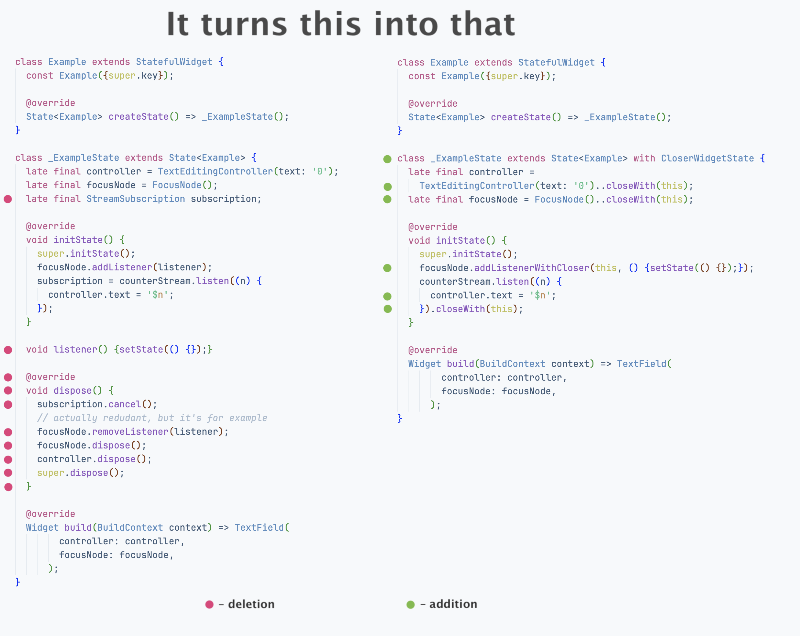
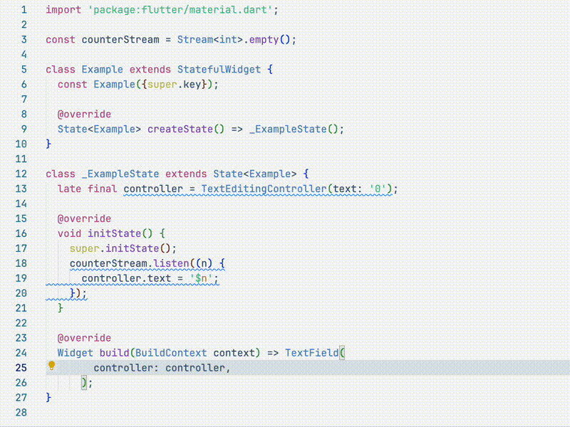

AutoClose — is a package designed to reduce the entire boilerplate from things that can be `.dispose()`d, `.close()`d or whatever!

## What exactly does this package do?

Let's take a closer look at what happened. On the left side you can see the `dispose()` block that has 
completely disappeared on the right side. And this is a definite advantage. But on the other hand, 
you may think differently. The stream subscription required three lines: variable declaration, subscription 
initialization, and subscription cancellation. Now we need a combined initialization and cancellation 
block + add a mixin to the class (and at the same time remember what the corresponding mixin is called). 
The advantages are no longer so obvious. Let me try to clear your doubts.

## Getting started

## Usage

## Additional information
