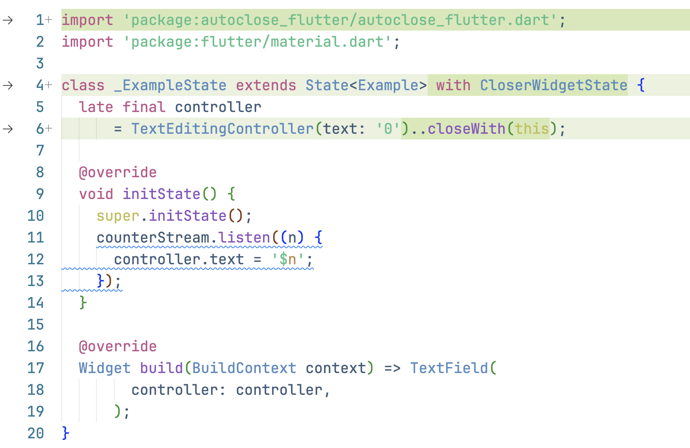

AutoClose — is a package designed to reduce the entire boilerplate from things that can be `.dispose()`d, `.close()`d or whatever!

## What exactly does this package do?


Let's take a closer look at what happened. On the left side you can see the `dispose()` block that has 
completely disappeared on the right side. And this is a definite advantage. But on the other hand, 
you may think differently. The stream subscription required three lines: variable declaration, subscription 
initialization, and subscription cancellation. Now we need a combined initialization and cancellation 
block + add a mixin to the class (and at the same time remember what the corresponding mixin is called). 
The advantages are no longer so obvious. Let me try to clear your doubts.


https://github.com/vlastachu/autoclose/assets/527307/8fca84b2-4ade-4193-9d36-21501a276115


Let's pay attention to what has changed after applying the first fix:



- added corresponding import
- added mixin which handles closable things when widget calls own `dispose` method
- added `closeWith` call which tells to Closer to handle that supscription

At this point, I hope you have formed an understanding that you definitely need this package and are ready to move on to the [How to install](#installation) chapter. If not, then let me try to explain why it's cool.

## Why this is actually cool

Let's highlight some pro's points:

- Reducing boilerplait **꙳**
- Highlights the places which needs your attention: when you enable lints you can see the places in your project which was (may be) forgotten to dispose
- When you decide to use `closeWith` it takes only one fix to enable
- Reduces amount of class fields, so you can focus on things which control something, excluding trash which should be cleaned
- Properly control order of `removeListener` with `dispose` (see Usage part)
- Prevents you to close twice

### ꙳ Reducing boilerplait

So what's the problem with boilerplait? Was this entire package created on the whim of the author because he was tired of writing repetitive code? And the only purpose of the package is to reduce the amount of code?

Almost yes. It is. But the boilerplait problem is wider then you may expect. It occurs:

1. When you writing code. With this package you might think that you no longer have to think when writing code. I have to disappoint you: you still need to think. There is still a cases when subscription lifetime does not match widget lifetime. For example when your subscription affects parent widget (I can't imagine such case, but sure it is exist). So when you writing code you should stop for a second and yourself: is it ordinary subscription like 99%, or is it something new. If it is ordinary, you just tap `⌘.` + `Enter`. If it is not you put `// ignore:` comment and good intent to write why you ignore.
2. When you reading code. The reader's attention fades when he sees a sequence of almost identical lines. He needs more cognitive effort to extract truly meaningful lines.
3. When you copy-pasting code (it would be more intelligent to call it refactoring). The previous two points are revealed precisely at this moment. 

When you copy-paste boilerpate code you have two options: waste your time and read it carefully, or just skip as it's not looks meaningful. It may affect you if there was some unique 1%  subsction with unusual flow. 

With this package all subsction flow concetrated in one place: initializtion + delayed destruction, or variable declaration + initializtion + delayed destruction. It is simpler to read. And as sayed before you have `// ignore:` as intent to read or write complicated cases carefully. 

## Installation

First of all you need to install this package

```
flutter pub add autoclose
flutter pub add autoclose_flutter
```

For now this package is useless for pure dart without flutter. But I hope sometime it will be changed.

If you are using the Bloc state manager you also should install corresponding package

```
flutter pub add autoclose_bloc
```

If you would like to see other state managers then let me know.

And I highly recommend you to install lint package

### AutoClose_Lints installation

Lints were created using custom_lint package (thank to guys from Invertase to that help in my dream setup). 
So that the installation is accompanied by corresponding and somewhat specific installation requirements of custom_lint:

```
flutter pub add dev:autoclose_lints dev:custom_lint
```

Add the following lines to your analysis_options.yaml:

```
analyzer:
  plugins:
    - custom_lint
```

Additionnaly you can [configure lints for your project](https://github.com/invertase/dart_custom_lint#enablingdisabling-and-configuring-lints).
For first time I recommend to enable all lints (this is default) to review all places which needs to your attention with closable things.

## Usage

When you succesfully install package with lints you will see lints in your project and should fix them by supplied fixes. This is the best way to get to know the package. Thus, you will learn about its capabilities through a practical example. Moreover, it will be a project familiar to you. Here I don’t see any point in listing all the wrapped entities.

Additionally to this you have `onCLose` optional parameter. 

```dart
stream.listen(listener).closeWith(this, onClose (){ print('stream was closed'); });
```

You can place there any relevant to closing operations (logs, metrics may be).
But in first order there is feature of closing operation: It has type `FutureOr<void>` in general case. For example stream subscription describes this:

```dart
  /// The stream may need to shut down the source of events and clean up after
  /// the subscription is canceled.
  ///
  /// Returns a future that is completed once the stream has finished
  /// its cleanup.
```

It is very rare case personally for me, but it has own place. So you may be need to execute something after resouce was closed, so there is onClose callback.

One more datail which wasn't mentioned before: you have `addListenerWithCloser` instead of raw `addListener`. 
This method promises to call `removeListener` when closers will close. I wrote [an article](https://medium.com/@vlastachu/flutter-that-rare-case-when-you-need-to-remove-listener-even-if-you-call-dispose-63193790e5c3) about the case when it's important.

## Extendability

There will definitely be a situation with you when the functionality of this package seems insufficient to you. Let's look at typical cases

- You use MobX, Reverpod or some other state manager, and can't close entity in their context. [Post me an issue with example how you regulary closes stream subscription with your state manager](https://github.com/vlastachu/autoclose/issues/new)
- You want to close entity, which wasn't covered by my package. There is two options: first if such entity comes from Dart or Flutter built-in package, then [fill an issue with entity's name](https://github.com/vlastachu/autoclose/issues/new)

The other option if it's comes from outside. For example in my project i use [mobile_scanner package](https://pub.dev/packages/mobile_scanner), which haw own MobileScannerController, which doesn't extend any class but have dispose [method](https://github.com/juliansteenbakker/mobile_scanner/blob/30b037c695178ac1c8f859ab4d4f80d6b443bbd3/lib/src/mobile_scanner_controller.dart#L397). It should be disposed as other closable entities, but I don't want to create `autoclose_mobile_scanner` package for such lib. I suggest you deal with this issue yourself in this way:

```dart
  final controller = MobileScannerController();
  doOnClose(() => controller.dispose());
```

The `doOnClose` is a method available in closer context. The single benefit from it's usage is that you handle closing in same place where you initialize a controller. In the future I plan to develop a guide on how a user can extent my package in his project along with lints and `closeWith` method.

## Further works

- scope-bound closure like `deffered` in Go
- more state managers
- more extendability

