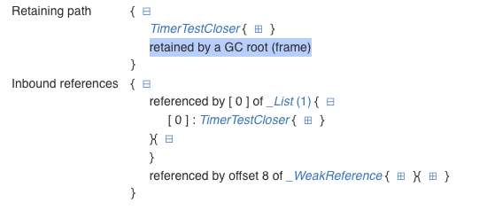

There is initial design of test, which was failed every time because my reference keeped by GC root 
(local variable or static class fields). I have no idea why.

```dart


class SubscriptionTestCloser extends TestCloser {
  SubscriptionTestCloser();

  // method to just catch reference on `this`
  void doAnything(dynamic any) {}

  void init(Stream stream) {
    stream.listen(doAnything).closeWith(this);
  }
}

StreamController streamController = StreamController.broadcast();
Stream stream = streamController.stream;

WeakReference<SubscriptionTestCloser> createAndInit(Stream stream) {
  // function used to not hold the hard link to closer
  final closer = SubscriptionTestCloser();
  closer.init(stream);
  return WeakReference(closer);
}
// ...
    test('closer.close remove all references by subcription', () async {
      
      final closerWeakRef = createAndInit(stream);
      // expect(streamController.hasListener, isTrue);


      // let's check the adequacy of our test: the reference to our closer object 
      // should not be cleared, as it was captured by the subscription
      // which expect to call **this**.doAnything() when event come to stream (actually never)
      // await forceGC();
      // expect(closerWeakRef.target, isNotNull);

      closerWeakRef.target?.close();
      await forceGC();
      expect(streamController.hasListener, isFalse);
      expect(streamController.isClosed, isFalse);
      expect(closerWeakRef.target, isNull); // FAILS HERE
    });
```


